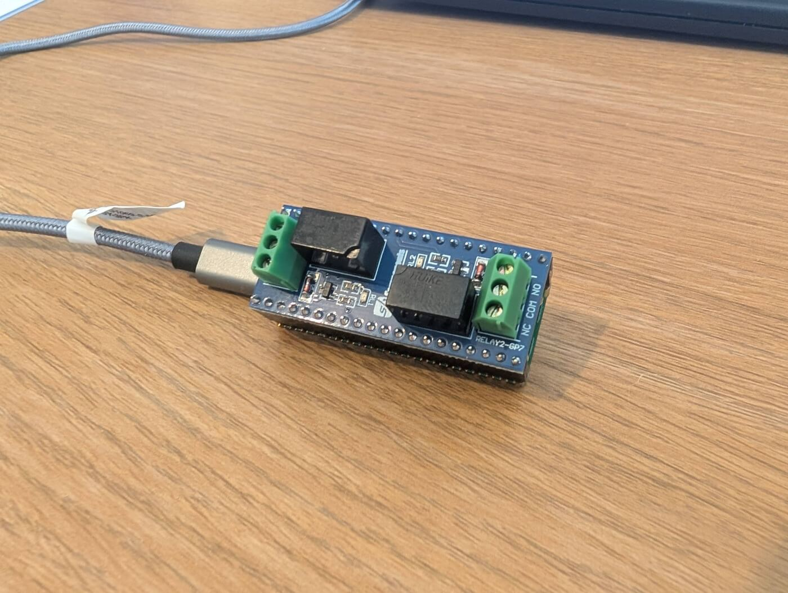
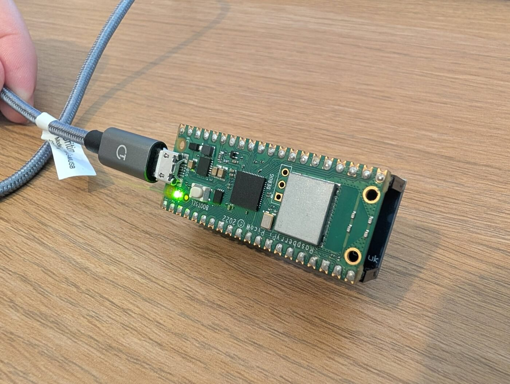

# Garage Door Opener

license MIT

* Version `1.0.0`
* Test with 1st gen RPI Pico W
* Tested with Micropython firmware `v1.25.0`

Micropython powered Garage door opener running on a [Raspberry Pi Pico W](https://www.raspberrypi.com/documentation/microcontrollers/pico-series.html#pico-1-family), with an [SB Component 3V Relay Hat](https://learn.sb-components.co.uk/Pico-3v-Relay-Hat), styled with [Tailwind](https://tailwindcss.com/) and hosted using the [Pimoroni Phew](https://github.com/pimoroni/phew) web server.

## Installation

* Install MicroPython on the Raspberry Pi Pico W ([get the installer here](https://micropython.org/download/RPI_PICO_W/)). Alternatively Micropython firmware `v1.25.0` for the 1st gen RPI Pico W is included in the `firmware` folder for this repo.
* Edit `src/config.py` to add your WiFi SSID, password and if required setup the GPIO pins to the relay, enable/disable relays and setup a PIN (Required).
* Copy the following files from `src` to the root of the device (there's a few ways of doing this, you could use [Thonny](https://thonny.org/) or [mpremote](https://docs.micropython.org/en/latest/reference/mpremote.html)):
  * `main.py`
  * `config.py`
  * `phew` (folder)
  * `templates` (folder)

## Running the Demo

* Having completed the above installation steps, reset the Pico W.
* It should start and connect to your WiFi and print its IP address to the MicroPython console.
* Using your browser, go to `http://<pico w ip address>/` to see the output.

## Misc
Built with help from:

* SB Component 3V Relay Hat demo code: [https://github.com/sbcshop/Pico-3V-Relay-HAT](https://github.com/sbcshop/Pico-3V-Relay-HAT)
* Simon Prickett's Phew demo code: [https://github.com/simonprickett/pimoroni-phew-template-demo](https://github.com/simonprickett/pimoroni-phew-template-demo)

## Demo

